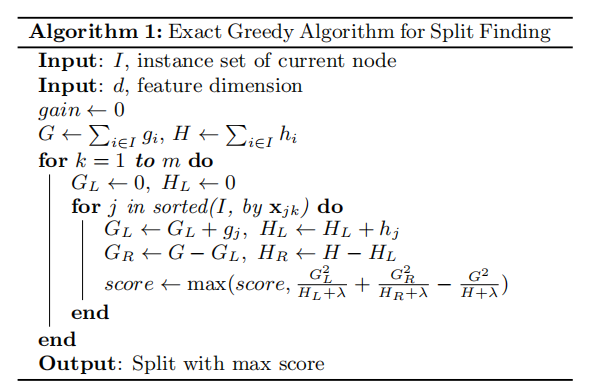

# SecureBoost

## 基础知识回顾

在引入SecureBoost之前，这里先回顾一下[XGboost算法](https://arxiv.org/pdf/1603.02754.pdf) 。XGboost算法作为提升树算法，算法模型可以表示为决策树的加法模型，即：

$$
\hat y_i = \sum_{k=1}^K f_k(x_i)
$$

其中$\hat y_i$表示$x_i$ 的预测值，$f_k(x_i)$ 表示第k棵决策树，K为决策树的个数。相应地，损失函数可以表示为:

$$
L^{(t)} = \sum_{i=1}^n l( y_i ,\hat y_i ^{(t-1)} + f_t(x_i)) + 	\Omega (f_t)
$$

其中 $ f_t(x_i) $是 第t棵树的预测结果，$ \Omega (f_t) $  是损失函数的正则项，$ \Omega (f_t) = \gamma T+ \frac {1}{2}  \lambda  ||\omega|| $，T代表第t棵树叶子节点个数，w 代表第t棵树叶子节点的权重。

在 XGboost 算法中使用二阶泰勒在点$( y_i ,\hat y_i ^{(t-1)} )$处展开来近似损失函数：

$$
L^{(t)} \approx \sum_{i=1}^n [l( y_i ,\hat y_i ^{(t-1)} )+  g_if_t(x_i) + \frac {1}{2} h_i f_t^2(x_i) ]+ \Omega (f_t)\\
$$

其中 $g_i = \partial_{\hat y^{(t-1)}}l(y_i,  \hat y^{(t-1)})$ 和 $h_i = \partial^2_{\hat y^{(t-1)}}l(y_i,  \hat y^{(t-1)})$。在损失函数中第一项$  y_i ,\hat y_i ^{(t-1)} $ 是已知的，因此$l(y_i,  \hat y^{(t-1)})$是一个常数，所以损失函数可以改写为：

$$
\begin{align*}
L^{(t)} & \approx \sum_{i=1}^n [ g_i f_t(x_i) + \frac {1}{2} h_i f_t^2(x_i)] +  \Omega (f_t) \\
 &= \sum_{j=1}^T[(\sum_{i \in I_j}g_i)w_j + \frac {1}{2}(\sum_{i \in I_j}h_i+ \lambda )w^2_j + \gamma T]
\end{align*}
$$

在上述公式中， $g_i,h_i,\gamma, \lambda$都是已知变量，$只有w_j$是未知变量，此时的损失函数可以看做是变量 $w_j$的二次函数，即可求出 $w_j$的最优值(极值点在一阶导数为零)，可以得到：

$$
w^*_j  = -\frac {\sum_{i \in I_j} g_i}{\sum_{i \in I_j} h_i+\lambda}
$$

将$w_j$带回损失函数$L^{(t)}$中，得到如下损失函数:

$$
L^{(t)} = -\frac {1}{2} \sum_{j=1}^T \frac {(\sum_{i \in I_j}g_i)^2}{\sum_{i \in I_j}h_i+ \lambda} + \gamma T    \tag{1}
$$

在XGboost中损失函数用来评价生成的树的得分，得分越小，说明树的结构越好。那么一棵树该选择哪个节点进行分裂，根据（1）引入节点信息增益的 $Gain$的概念：

$$
Gain =\frac {1}{2} [ \frac {(\sum_{i \in I_L}g_i)^2}{\sum_{i \in I_L}h_i+ \lambda} + \frac {(\sum_{i \in I_R}g_i)^2}{\sum_{i \in I_R}h_i+ \lambda}- \frac {(\sum_{i \in I}g_i)^2}{\sum_{i \in I}h_i+ \lambda}]- \gamma
$$

XGboost算法的节点分裂后将会把该节点的样本空间分为两个互不相交的空间，$I_L$和$I_R$分别表示分裂后左右节点的样本空间，在当前所有叶子节点中我们选择信息增益最大的那个节点作为分裂点。可以得到XGboost的算法流程：

算法1称为贪心算法，因为其在求信息增益时第一个循环需要对叶子节点的m个特征都做线性搜索，第二个循环需要对每个特征取值排序后计算信息增益。当样本是连续型变量或者取值较多时算法的执行效率会很慢。因此，在实际应用更多采用近似寻找分裂点的算法（算法2），采用先对特征进行分段处理，只需计算出第k个特征每个分位点里样本的一阶导的和 $G_{kv}$和二阶导的和 $H_{kv}$，最后计算邻近分位点的信息增益，这样大幅度降低了计算量。

以上过程主要描述了 XGboost算法思想，为了更好地理解secureboost算法，这里补充平方损失函数和对数损失函数的 $g_i$ 和 $h_i$:

|          | 形式                                                      | $g_i$                       | $h_i$                    |
| ---------- | ----------------------------------------------------------- | ----------------------------- | -------------------------- |
| 平方损失 | $loss(y_i,\hat y_i^{(t-1)}) = (y_i - \hat y_i^{(t-1)})^2$ | $2(y_i- \hat y_i^{(t-1)} )$ | 2                        |
| 对数损失 | $loss(y_i,\hat y_i^{(t-1)}) = y_ilog \, p-(1-y_i)log(1-p)$ | $P_i^{t-1} -y_i$            | $P_i^{t-1}(1-P_i^{t-1})$ |

平方损失函数很容易得到，对数损失函数简单推理如下：

一阶导数：

$$
g_i = \frac {\partial {l(y_i, \hat y^{(t-1)})} } {\partial {\hat y^{(t-1)}}} = -y_i(1-\frac{1}{1+e^{-\hat y_i^{t-1}}})+(1-y_i)\frac{1}{1+e^{-\hat y_i^{t-1}}} = \frac{1}{1+e^{-\hat y_i^{t-1}}}-y_i = P_i^{t-1} -y_i
$$

二阶导数：

$$
h_i = \frac {\partial^2 {l(y_i, \hat y^{(t-1)})} } {\partial^2 {\hat y^{(t-1)}}} = \frac{e^{-\hat y_i^{t-1}}}{(1+e^{-\hat y_i^{t-1}})^2} =P_i^{t-1}(1-P_i^{t-1})
$$

## 纵向联邦学习

### 节点分裂过程

$$
Gain =\frac {1}{2} [ \frac {(\sum_{i \in I_L}g_i)^2}{\sum_{i \in I_L}h_i+ \lambda} + \frac {(\sum_{i \in I_R}g_i)^2}{\sum_{i \in I_R}h_i+ \lambda}- \frac {(\sum_{i \in I}g_i)^2}{\sum_{i \in I}h_i+ \lambda}]- \gamma
$$

从以上推理可以看出，树分裂点Gain 和叶子节点的权重计算只与$g_i$和$h_i$有关，这给构造 [secureboost算法](https://arxiv.org/pdf/1901.08755.pdf) 带来了很大的方便。

我们知道在纵向多方建模时，只有promoter方含有标签值，参与方provider没有有标签。如果promoter计算把计算的$g_i$和$h_i$发送给provider，provider就能根据信息增益公式计算自己本地数据的最优分割点。但是从损失函数的计算可以看到，如果provider方知道$g_i$和$h_i$，又知道前一棵树的训练结果，那他很容易就能推算出y标签值。因此，$g_i$和$h_i$明文数据是不能直接透漏给provider参与方，这个时候引入了加法同态加密算法，promoter把每个样本的$g_i$和$h_i$进行加法同态加密后再发给provider，provider在接收到的$g_i$和$h_i$是密文状态，provider不能推断出promoter放的标签数据。

同态加密的 $[[g_i]]$和$[[h_i]]$ 保持加法的同态性，provider可以直接计算分裂点的的加密梯度聚合信息  $\sum_{i}[[g_i]]$和$\sum_{i}[[h_i]]$，将计算结果并返回到promoter。promoter解密后就可以得到了 provider的梯度聚合信息$\sum_{i}g_i$和$\sum_{i}h_i$，这样promoter方就可以根据多方信息计算出全局特征的最优的分割点，交互如下图所示：

step1：promoter方先计算出 $g_i$和$h_i$，$g_i$和$h_i$的计算方法在第一小节中已经讨论过两种。假设使用对数损失函数，初始化参数$y_i = 0$，即初始 P =0.5。promoter计算出每个样本的 $g_i$和$h_i$后，使用同态加密发送给各个参与方provider。

step2：promoter初始化 root节点，计算出root节点的 $\sum_{i \in I}g_i$和$\sum_{i \in I}h_i$ 。

- promoter对本地数据采用近似寻找分裂点算法进行特征分箱编码，对于每个特征计算出不同分桶内的梯度聚合信息$G_{kv}$ 和 $H_{kv}$，并计算出本地的最优分裂点信息；
- provider 接收到$[[g_i]]$和$[[h_i]]$后，根据自己放的数据分桶计算出每个桶内的梯度聚合信息$E(G_{kv})$ 和 $E(H_{kv})$。

step3：provider将自己的特征 id 和分箱id进行mask操作后于桶内梯度聚合信息$E(G_{kv})$ 和 $E(H_{kv})$一同返回给promoter。

step4：计算全局最优分裂点。

- promoter 接收到梯度聚合信息后解密，计算 provider 方的局部最优分裂结果，并将最优分裂特征的 mask _id 信息返回provider。
- provider进行unmask 操作，并将特征 id 返回给promoter。
- promoter接收到特征id后，计算全局最优分裂结果并根据最优分裂点，根据最优分裂点更新新的节点信息和各个节点样本的分布。

### 安全性说明

在训练过程中为了保证数据的保密性，promoter和provider的训练过程遵循一下的安全规则：

1. promoter独自生成第一棵树，保证了即是provider反推也只能推到到第二层，无法获得标签值y的信息，保证了promoter的标签信息的安全。
2. provider在分裂过程中的局部最优分裂点对promoter不是完全公开的，promoter只知道provider的身份id和最优分裂点特征id，具体特征分箱编号id对其保密，这保证了provider数据的安全性。

算法总体流程如下：

step1：发起方promoter方初始化参数 $y_i = 0$，计算每个样本的$g_i$和$h_i$ ，根据近似寻找分裂点算法，独自生成第一颗决策树。

step2：根据叶子节点权重更新参数 $y_i$的值，并更新样本的$g_i$和$h_i$，将加密的$g_i$和$h_i$发送给参与方，根据第一节中节点分裂过程多方协作生成第二棵决策树。

step3：重复step2的过程，直至达到最优分裂或达到最大棵树，停止分裂得到最后的模型，保存模型。

在预测过程中，每个参与方仅仅拥有自己方特征分裂点的完整信息，因此在预测过程中需要多方合作者协作确定样本的叶子节点。确定样本的叶子节点后，由promoter方根据每棵树叶子节点权重计算出样本的预测值。

## 横向联邦学习

横向联邦学习参与方都含有标签值y， 因此在横向中不需要相互发送加密的梯度聚合信息。各方可使用安全聚合方法把信息传送给一个第三方，通过第三方来聚合信息，如求梯度和$\sum g_i$所示：

横向树模型中主要使用安全聚合方法，分裂过程如下：

在每个节点都由arbiter计算全局的最优分裂点，然后把计算结果返回各方，如此迭代个节点建立安全树模型。
